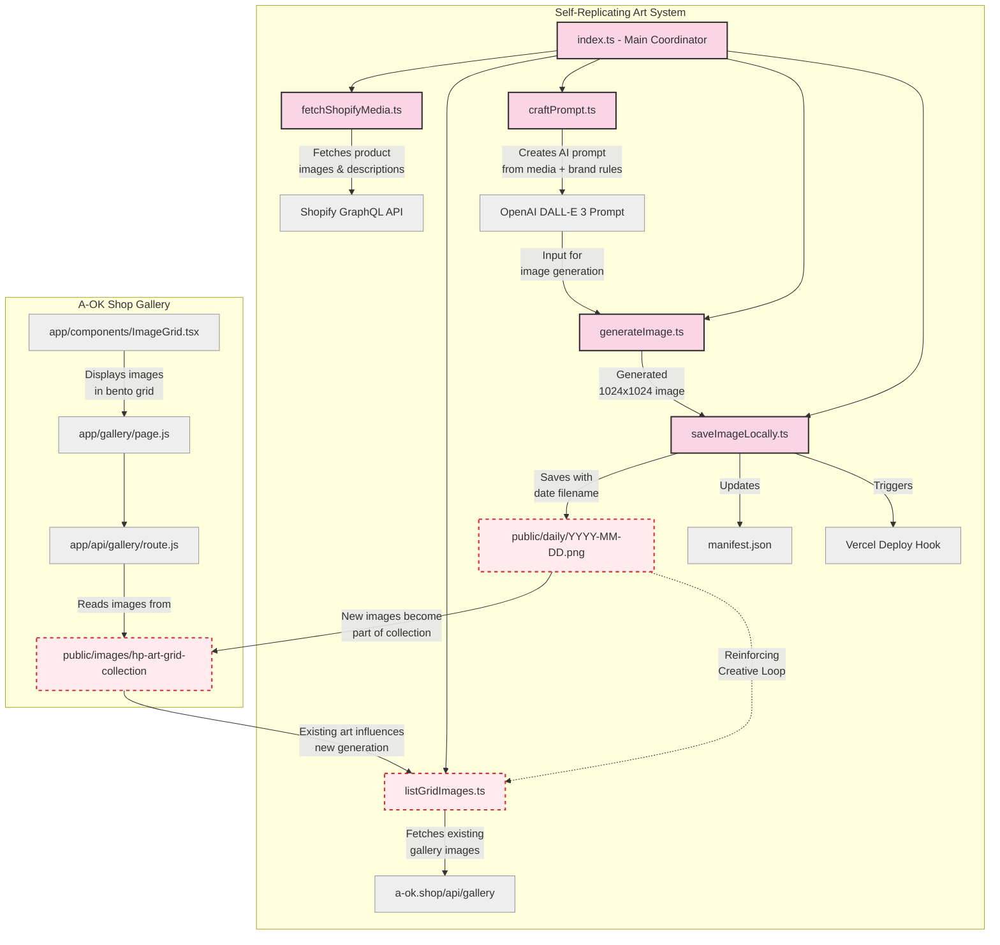

## Self-Replicating Art System: Reinforcing Creativity Loop

This diagram illustrates how the self-replicating art system works in conjunction with the A-OK Shop gallery to create a reinforcing creative loop:

1. **Data Collection Phase**:
   - System fetches existing visual content from Shopify products
   - System fetches existing gallery images from a-ok.shop/api/gallery
   
2. **Generation Phase**:
   - Crafts AI prompts combining brand rules and existing imagery descriptions
   - Generates new images via OpenAI's DALL-E 3
   - Saves generated images with date-based filenames (YYYY-MM-DD.png)
   - Updates manifest.json and triggers deployment

3. **Display Phase**:
   - A-OK Shop gallery displays images in a responsive grid layout
   - New AI-generated images become part of the gallery

4. **The Reinforcing Loop**:
   - Each day's new AI-generated image becomes part of the collection
   - These images then influence future generations via the prompt crafting
   - The system evolves while maintaining brand consistency
   - Visual style adapts over time while preserving core brand identity

This creates a "self-replicating" art system where new creations are influenced by previous creations, forming a continuously evolving visual identity within the defined brand parameters.